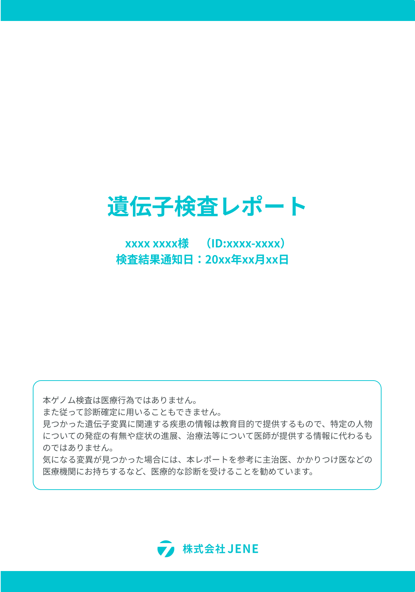
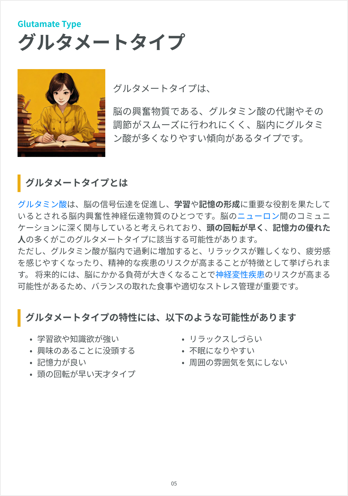
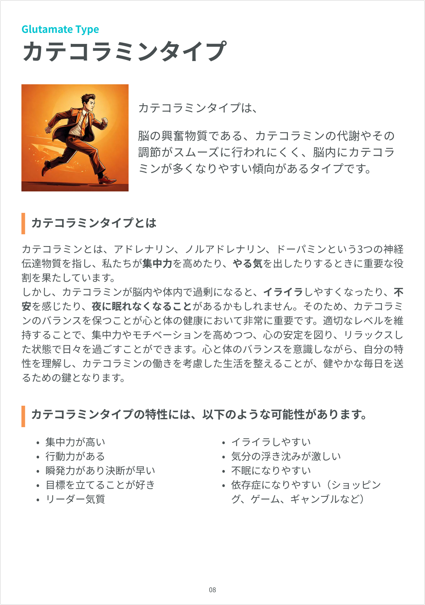
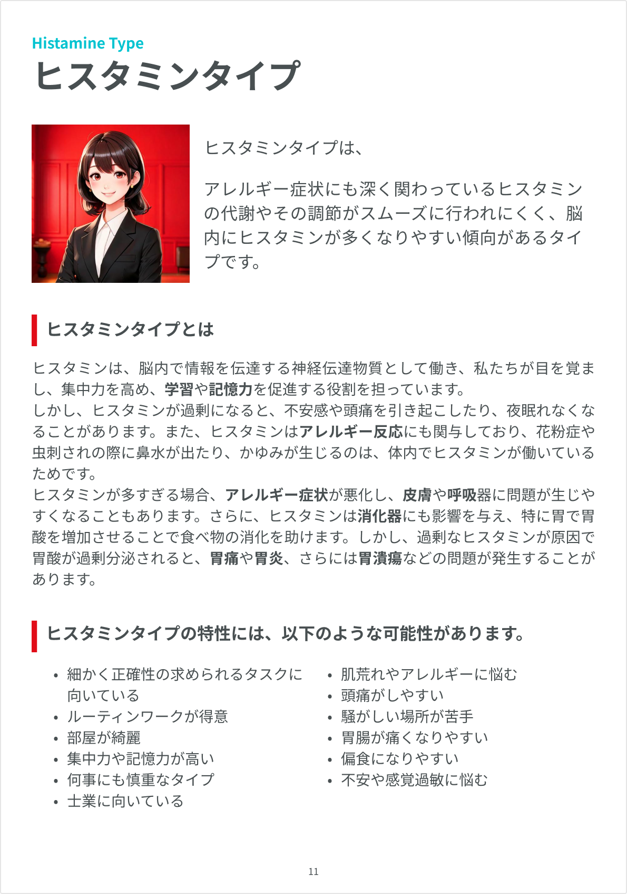
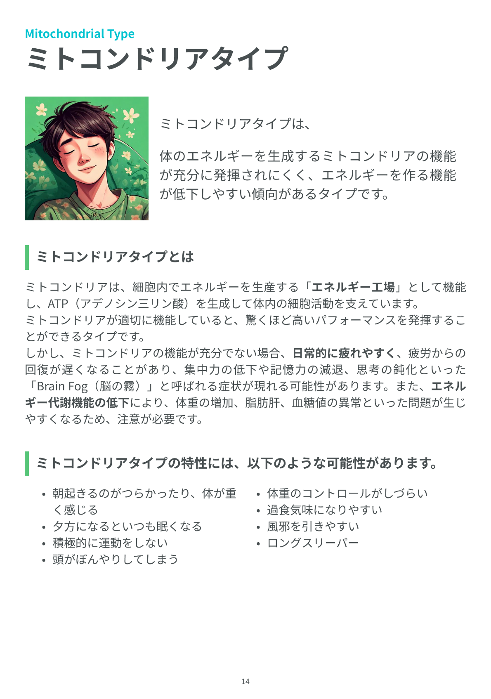
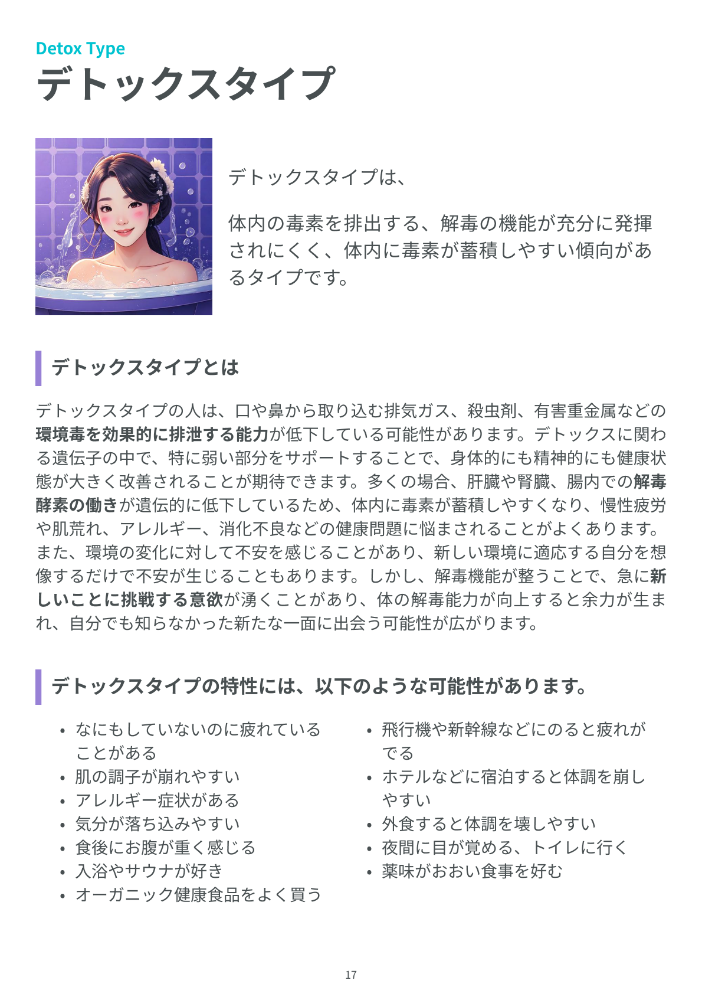
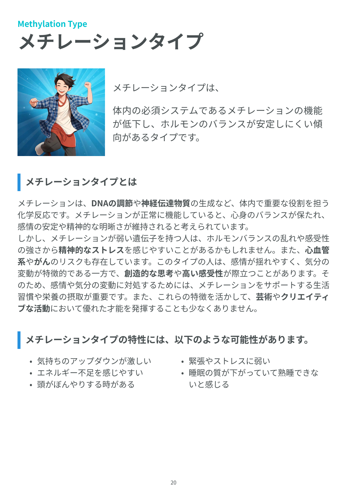
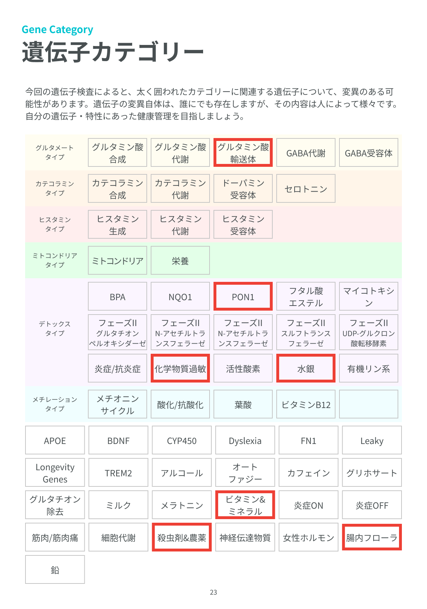

# DNA報告書半自動生成システム 

本システムは、顧客の遺伝子検査データを**CSV**形式で受け取り、既存のデザインテンプレートに基づいて検査レポートの可変部分を自動的に埋め、**PDF形式**でレポートを生成することを目的としています。

The system aims to receive customer genetic testing data in **CSV** format, automatically fill in the variable parts of the test report based on existing design templates, and generate the report in **PDF format**.

[当初はJSON形式でデータを受け取る予定でしたが、その後、お客様のご要望によりCSV形式に変更されました。ただし、これはデータ形式の変更のみであり、プロジェクト全体のパフォーマンスやアーキテクチャには影響しません。]

[Initially, it was expected that data would be received in JSON format, but later it was replaced with CSV format at the customer's request. However, it is only a change in data format and does not affect the overall performance and architecture of the project.]

## Preview  

🚀 [Live preview](https://tailwind-dashboard-template-dashwind.vercel.app/)





## Features

- **Submenu support** in sidebar
- Store management using **redux toolkit**


## Installation

Go to project directory and run (make sure you have node installed first)

```bash
  npm install
  npm start
```
    
## Core Libraries Used

- [React JS v18.2.0](https://reactjs.org/)
- [React Router v6.4.3](https://reactrouter.com/en/main)
- [Tailwind CSS v3.2.4](https://tailwindcss.com/)
- [Daisy UI v2.41.0](https://daisyui.com/)
- [HeroIcons](https://heroicons.com/)
- [Redux toolkit v1.9](https://redux-toolkit.js.org/)
- [React ChartJS 2 v5](https://react-chartjs-2.js.org/)

## Documentation

[Documentation](https://.vercel.app/documentation)

## Pages

|                          |                               |
:-------------------------:|:-------------------------:
|  
| 
|  




## Preview

🚀 [Live preview](https://.vercel.app/)


## Technologies

Structured Architecture

React-Redux Toolkit

HOC(High Order Component)

## Feedback

If you have any feedback, please reach out [me] highmountain430@gmail.com